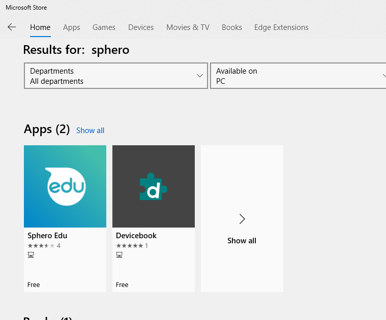

# Sphero Installation

To use Sphero Edu on your computer it requries Bluetooth 4.0 Low Energy hardware compatible, or BLE.  
If your computer doesn't have it you can aquire a USB-BLE donle and add it..

## Installing Sphero Chome Browser
For to:
https://chrome.google.com/webstore/detail/sphero-edu/hfiocchbmngcelgfdcfbepgoipapddlh?hl=en

## Installing on Windows 10

Go to the Windows APP Store and search for "Sphero Edu".  
  

After Install, open and log in the APP, Use your sphero account;

# Conneting Sphero.

On the lower rigth side of the APP click on "Connect Robot":  
{
    setMainLed({r:0, g:0, b:255}); // This will turn the sphero Blue
    await delay(2);                // Stay on this condition for 2s
    await fade({ r: 0, g: 255, b: 0 }, { r: 255, g: 0, b: 0 }, 3.0) // This Command will change lights from Green to RED in 3s
}
```  

**Making the Sphero run in a triangle shape:**  
```java
async function startProgram(){
    setMainLed({r:50, g:50, b:50}); // Set light faded white
    setHeading(0);                  // adjust the position for 0 degrees
    setSpeed(50);                   // run at speed 50 
    await delay(2);                 // Stay on this condition for 2s
    setSpeed(0);                    // Stop
    
    setHeading(120);                // adjust the position for 120 degrees
    setSpeed(50);                   // run at speed 50 
    await delay(2);                 // Stay on this condition for 2s
    setSpeed(0);                    // Stop
    
    setHeading(240);                // adjust the position for 240 degrees
    setSpeed(50);                   // run at speed 50 
    await delay(2);                 // Stay on this condition for 2s
    setSpeed(0);                    // Stop
    await fade({ r: 255, g: 255, b: 255 }, { r: 0, g: 0, b: 0 }, 3.0) // Fade lights off
}
``` 

**Making it in a smarter way :)**  
```java
async function startProgram(){
  var angle = 0;
  setMainLed({r:50, g:50, b:50}); // Set light faded white
  while (angle <= 240)
  {
    setHeading(angle);              // adjust the position
    setSpeed(50);                   // run at speed 50 
    await delay(2);                 // Stay on this condition for 2s
    setSpeed(0);                    // Stop
    angle += 120;
   }
   await fade({ r: 255, g: 255, b: 255 }, { r: 0, g: 0, b: 0 }, 3.0) // Fade lights off
}
``` 


